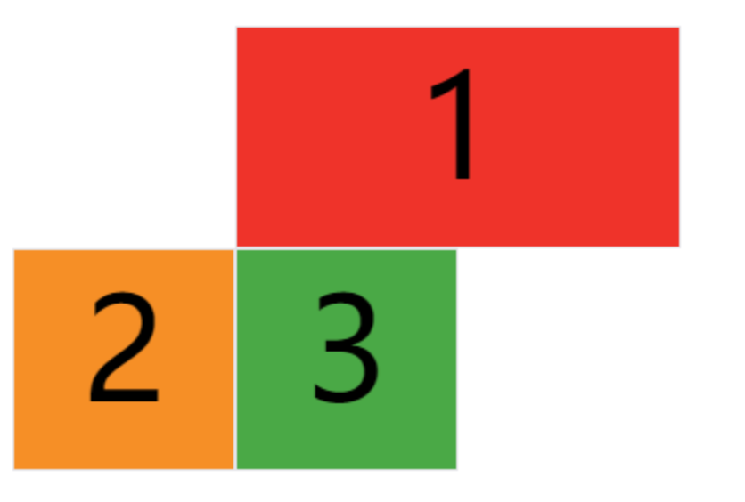

# grid 网格布局 [​](#grid)

## display [​](#display)

- display：grid 则该容器是一个块级元素
- display: inline-grid 则容器元素为行内元素

## grid-template [​](#grid-template)

grid-template-columns 属性设置列宽、grid-template-rows 属性设置行高

```css
.wrapper {
  display: grid;
  /*  声明了三列，宽度分别为 200px 200px 200px */
  grid-template-columns: 200px 200px 200px;
  grid-gap: 5px;
  /*  声明了两行，行高分别为 50px 50px  */
  grid-template-rows: 50px 50px;
}
```

- repeat()函数 第一个参数是重复的次数，第二个参数是值

```css
.wrapper {
  display: grid;
  grid-template-columns: repeat(3, 200px);
  grid-gap: 5px;
  grid-template-rows: repeat(2, 50px);
}
```

- auto-fill：自动填充让一行（或者一列）中尽可能的容纳更多的单元格

  > grid-template-columns: repeat(auto-fill, 200px) 表示列宽是 200 px，但列的数量是不固定的，只要浏览器能够容纳得下，就可以放置元素

- fr：片段，为了方便表示比例关系

  > grid-template-columns: 200px 1fr 2fr 表示第一个列宽设置为 200px，后面剩余的宽度分为两部分，宽度分别为剩余宽度的 1/3 和 2/3

- auto：由浏览器自己决定长度
  > grid-template-columns: 100px auto 100px 表示第一第三列为 100px，中间由浏览器决定长度

## grid-row-gap、grid-column-gap、grid-gap [​](#grid-gap)

- grid-row-gap 属性、grid-column-gap 属性分别设置行间距和列间距。grid-gap 属性是两者的简写形式
- grid-row-gap: 10px 表示行间距是 10px
- grid-column-gap: 20px 表示列间距是 20px
- grid-gap: 10px 20px 等同上述两个属性

## grid-auto-flow [​](#grid-auto-flow)

类似于 flex-direction

> 排放顺序由 grid-auto-flow 决定，默认为行，代表"先行后列"，即先填满第一行，再开始放入第二行
> grid-auto-flow：column 改为先列后行

## justify-items、align-items、place-items [​](#item)

> justify-items 属性设置单元格内容的水平位置（左中右），align-items 属性设置单元格的垂直位置（上中下），place-items 属性是合并简写

```css
/* stretch：拉伸，占满单元格的整个宽度（默认值）*/
.container {
  justify-items: start | end | center | stretch;
  align-items: start | end | center | stretch;
}
```

## justify-self、align-self、place-self [​](#self)

- 类似与 justify-items，但是作用于子项

## justify-content、align-content [​](#justify-align)

同 flex 布局

## grid-column-start、grid-column-end、grid-row-start、grid-row-end [​](#grid-column-row)

> 指定网格项目所在的四个边框，分别定位在哪根网格线，从而指定项目的位置

```html
<style>
  #container {
    display: grid;
    grid-template-columns: 100px 100px 100px;
    grid-template-rows: 100px 100px 100px;
  }
  .item-1 {
    grid-column-start: 2;
    grid-column-end: 4;
  }
</style>

<div id="container">
  <div class="item item-1">1</div>
  <div class="item item-2">2</div>
  <div class="item item-3">3</div>
</div>
```

- 指定 1 号项目的左边框是第二根垂直网格线，右边框是第四根垂直网格线



## grid-template-areas [​](#grid-template-areas)

用于定义区域

```css
.container {
  display: grid;
  grid-template-columns: 100px 100px 100px;
  grid-template-rows: 100px 100px 100px;
  grid-template-areas:
    'a b c'
    'd e f'
    'g h i';
}
```

## grid-area [​](#grid-area)

指定项目放在哪一个区域，搭配 grid-template-areas 使用


