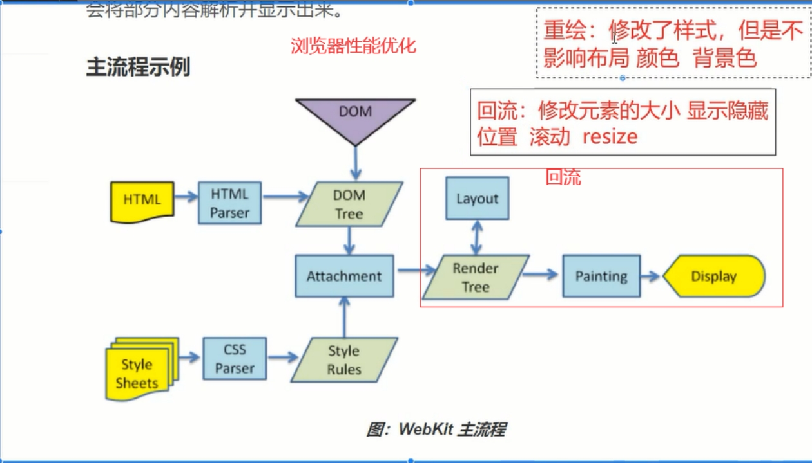
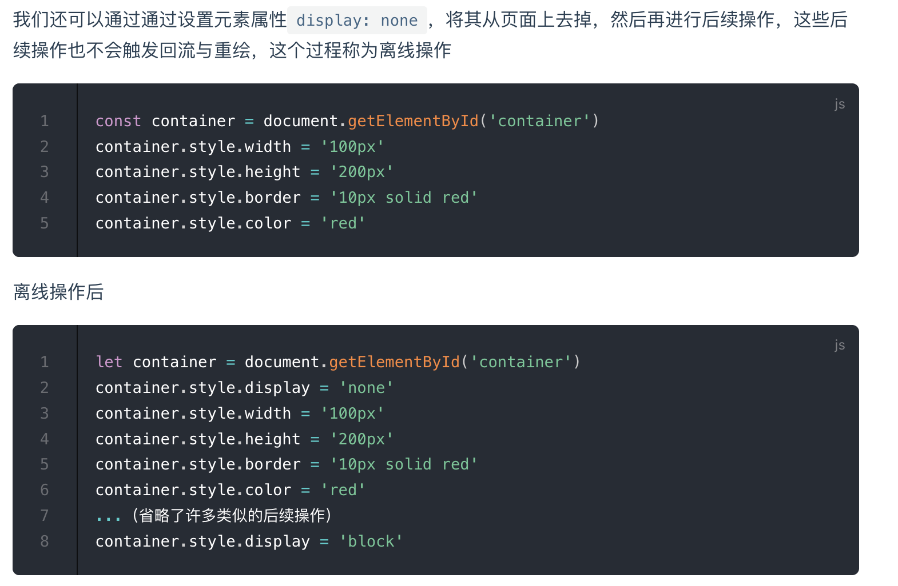

# 重绘和回流（重排） [​](#rendering)

## 描述 [​](#describe)

- 解析 HTML，生成 DOM 树，解析 CSS，生成 CSSOM 树
- 将 DOM 树和 CSSOM 树结合，生成渲染树(Render Tree)
- Layout(回流):根据生成的渲染树，进行回流(Layout)，得到节点的几何信息（位置，大小）
- Painting(重绘):根据渲染树以及回流得到的几何信息，得到节点的绝对像素
- Display:将像素发送给 GPU，展示在页面上

## 回流的触发时机 [​](#back-flow)

- 添加或删除可见的 DOM 元素
- 元素的位置发生变化
- 元素的尺寸发生变化（包括外边距、内边框、边框大小、高度和宽度等）
- 内容发生变化，比如文本变化或图片被另一个不同尺寸的图片所替代
- 页面一开始渲染的时候（这避免不了）
- 浏览器的窗口尺寸变化（因为回流是根据视口的大小来计算元素的位置和大小的）

## 重绘的触发时机 [​](#anew-rendering)

- 触发回流一定触发重绘
- 颜色的修改
- 文本方向的修改
- 阴影的修改

## 减少 CSS 回流方式 [​](#reduce-mode)

- 避免频繁操作 DOM：尽可能地批量进行 DOM 操作（通过类名），避免频繁地读取和修改 DOM

- 使用虚拟 DOM：通过使用虚拟 DOM 库，如 React 或 Vue，可以避免直接操作 DOM，从而减少回流次数

- 避免使用 table 布局：使用 CSS 布局可以减少回流次数，因为它们不需要像 table 布局那样重新计算整个表格的布局

- 避免多层嵌套的 DOM 结构：多层嵌套的 DOM 结构会增加浏览器的回流次数，因此应该尽可能地减少 DOM 的嵌套

- 使用 transform 属性代替 top 和 left：使用 transform 属性来移动元素可以减少浏览器的回流次数，因为它只需要重新绘制元素，而不需要改变整个页面的布局

- 设置 display：none 后操作，称为离线操作

  
