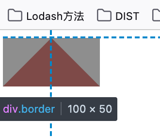
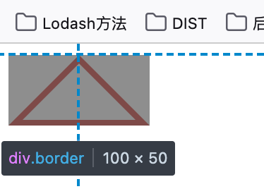
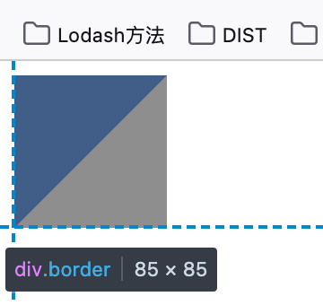

# CSS 三角形 [​](#triangle)

## 默认三角形 [​](#default)

通过隐藏上面边框，除了下边框其余边框颜色设置为透明，得到宽为 100，高为 50 的三角

```css
.border {
  width: 0;
  height: 0;
  border-style: solid;
  border-width: 0 50px 50px;
  border-color: transparent transparent #d9534f;
}
```



## 空心三角形 [​](#hollow)

通过设置伪元素画一个空心的三角形

```css
.border {
  width: 0;
  height: 0;
  border-style: solid;
  border-width: 0 50px 50px;
  border-color: transparent transparent #d9534f;
  position: relative;
}
.border:after {
  content: '';
  border-style: solid;
  border-width: 0 40px 40px;
  border-color: transparent transparent #96ceb4;
  position: absolute;
  top: 0;
  left: 0;
}
```



## 直角三角形 [​](#right-angle)

```css
.box {
  /* 内部大小 */
  width: 0px;
  height: 0px;
  /* 边框大小 只设置两条边*/
  border-top: #4285f4 solid;
  border-right: transparent solid;
  border-width: 85px;
}
```


