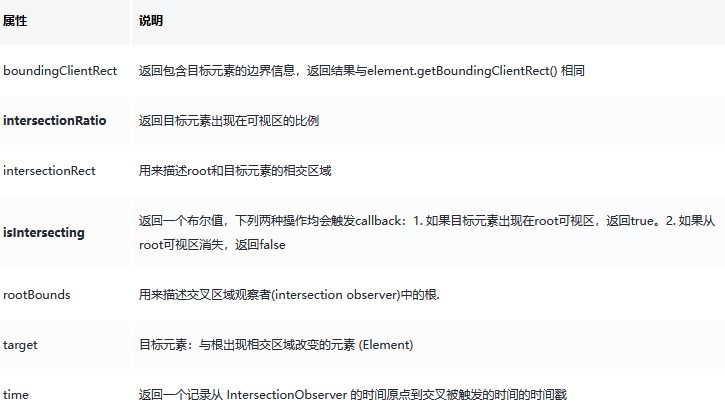

# IntersectionObserver 判断元素是否在区域中 [](#IntersectionObserver)

## 创建观察者 [](#create)

```js
const options = {
  // threshold表示重叠面积占被观察者的比例，从 0 - 1 取值，
  // 1 表示完全被包含
  threshold: 1,
  root:document.querySelector('#scrollArea') // 必须是目标元素的父级元素
};

const callback = (entries, observer) => { ....}

const observer = new IntersectionObserver(callback, options);
```

通过 new IntersectionObserver 创建了观察者 observer，传入的参数 callback 在重叠比例超过 threshold 时会被执行`，callback 中 entries 常用属性如下：



## 传入被观察者 [](#observe)

```js
const target = document.querySelector('.target')
observer.observe(target)
```

## 应用 [](#application)

### 图片懒加载

```js
const imgList = [...document.querySelectorAll('img')]

var io = new IntersectionObserver(
  (entries) => {
    entries.forEach((item) => {
      // isIntersecting是一个Boolean值，判断目标元素当前是否可见
      if (item.isIntersecting) {
        item.target.src = item.target.dataset.src
        // 图片加载后即停止监听该元素
        io.unobserve(item.target)
      }
    })
  },
  {
    root: document.querySelector('.root')
  }
)

// observe遍历监听所有img节点
imgList.forEach((img) => io.observe(img))
```

### 埋点曝光

> 假如有个需求，对一个页面中的特定元素，只有在其完全显示在可视区内时进行埋点曝光

```js
const boxList = [...document.querySelectorAll('.box')]

var io = new IntersectionObserver(
  (entries) => {
    entries.forEach((item) => {
      // intersectionRatio === 1说明该元素完全暴露出来，符合业务需求
      if (item.intersectionRatio === 1) {
        // 。。。 埋点曝光代码
        io.unobserve(item.target)
      }
    })
  },
  {
    root: null,
    threshold: 1 // 阀值设为1，当只有比例达到1时才触发回调函数
  }
)

// observe遍历监听所有box节点
boxList.forEach((box) => io.observe(box))
```
