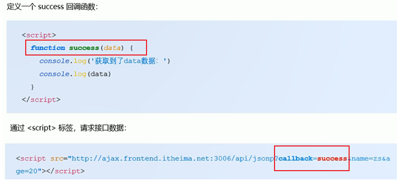

# 跨域的解决方法 [](#cross-domain)

- JSONP：通过 script 标签的 src 属性请求跨域的数据接口，并通过函数调用的形式接收响应回来的数据，只支持 get 请求



- cors：跨域资源共享：服务端需要在 HTTP 响应头中添加 Access-Control-Allow-Origin

- 反向代理

- iframe 通信：postMessage，targetWindow.postMessage(message,targetOrigin)，targetOrigin 指定接受消息的窗口的源

```js
// 父页面
mounted(){
    window.addEventListener("message", this.handleMessage)
},
methods:{
    // 向iframe传值的方法  @param {Object} data
    sendMessage(data){
        const iframe = this.$refs.iframePage.contentWindow;
        iframe.postMessage(data, '*');
    },
    // 监听子页面传过来的值的方法  @param {Object} event
    handleMessage (event) {
        // dosomething
    }
}

// 子页面
mounted(){
    window.addEventListener("message", this.handleMessage)
},
methods:{
    // 向父页面传值的方法   @param {Object} data
    sendMessage(data){
        window.parent.postMessage(data, '*');
    }
    // 监听父页面传过来的值的方法  @param {Object} event
    handleMessage (event) {
        // dosomething
    }
}
```
