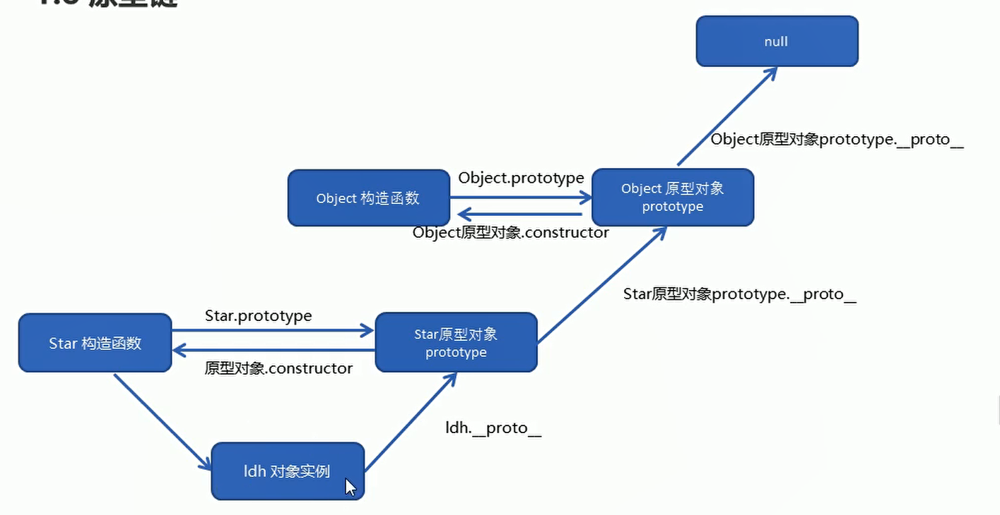

# 原型、原型链 [](#prototype)



- 每个对象的`__proto__`都是指向它的构造函数的原型对象（prototype）

```js
ldh.__proto__ === Star.prototype
```

- 构造函数是一个函数对象，是通过 Function 构造器产生的

```js
Star.__proto__ === Function.prototype
```

- Object 的原型对象也有`__proto__`属性指向 null，null 是原型链的顶端

```js
Object.prototype.__proto__ === null
```

- Function 对象的`__proto__`会指向自己的原型对象，最终还是继承自 Object 对象

```js
Function.__proto__.__proto__ === Object.prototype
```
