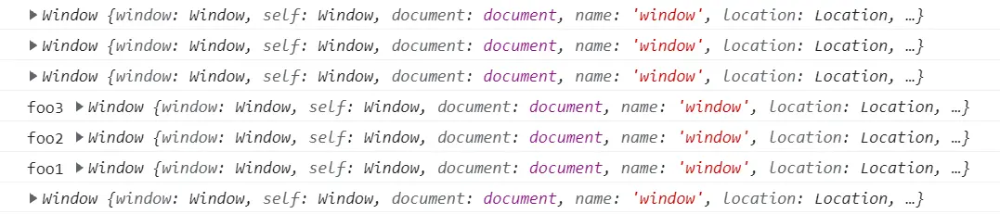
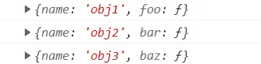
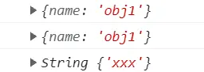
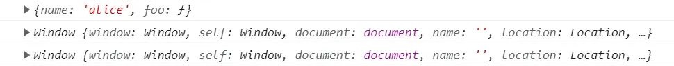
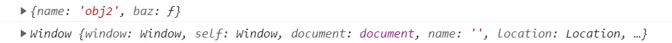

# this 关键字指向 [](#this-keyword)

> this 的指向和函数在哪里定义无关，和如何调用有关

## this 的四种绑定方式 [](#binding-method)

### 默认绑定

> 当函数独立调用时，this 默认绑定 window

```js
// 1、直接调用
function foo() {
  console.log(this)
}
foo()

// 2、对象中的函数
var obj1 = {
  foo: foo
}
var fn1 = obj1.foo
fn1()

// 3、被全局变量引用
var obj2 = {
  bar: function () {
    console.log(this)
  }
}
var fn2 = obj2.bar
fn2()

// 4、函数嵌套调用
function foo1() {
  console.log('foo1', this)
}
function foo2() {
  console.log('foo2', this)
  foo1()
}
function foo3() {
  console.log('foo3', this)
  foo2()
}
foo3()

// 5、通过闭包调用
var obj2 = {
  bar: function () {
    return function () {
      console.log(this)
    }
  }
}
obj2.bar()()
```

执行结果如下：



> 以上五种调用方式全都属于默认绑定，因为他们最终都是单独的对函数进行调用

### 隐式绑定

> 调用的对象内部有对函数的引用

```js
function foo() {
  console.log(this)
}

var obj1 = {
  name: 'obj1',
  foo: foo
}
obj1.foo()

var obj2 = {
  name: 'obj2',
  bar: function () {
    console.log(this)
  }
}
obj2.bar()

var obj3 = {
  name: 'obj3',
  baz: obj2.bar
}
obj3.baz()
```

以上代码执行结果为：



> 以上三种都属于隐式绑定，他们都是通过对象调用，this 就指向了该对象

### 显示绑定

> 不希望在对象内部包含这个函数的引用，但又希望通过对象强制调用，使用 call/apply/bind 进行显式绑定

```js
function foo() {
  console.log(this)
}
var obj = {
  name: 'obj1'
}

foo.call(obj)
foo.apply(obj)
foo.call('xxx')
```

以上代码的执行结果为



> foo 函数直接调用 this 应该指向 window，这里通过 call/apply 来改变了 this 的指向

### new 绑定

> 通过 new 关键字来创建构造函数的实例，绑定 this

- 通过构建函数 new 关键字生成一个实例对象，此时 this 指向这个实例对象

```js
function test() {
  this.x = 1
}

var obj = new test()
obj.x // 1
```

- new 过程遇到 return 一个对象，此时 this 指向为返回的对象

```js
function fn() {
  this.user = 'xxx'
  return {}
}
var a = new fn()
console.log(a.user) //undefined
```

- 如果返回一个简单类型的时候，则 this 指向实例对象（返回 null 也是）

```js
function fn() {
  this.user = 'xxx'
  return 1 / null
}
var a = new fn()
console.log(a.user) //xxx
```

## this 绑定的优先级 [](#priority)

### 隐式绑定高于默认绑定

```js
function foo() {
  console.log(this)
}

var obj = {
  name: 'obj',
  foo: foo
}
obj.foo()
```

以上代码执行结果为：


> foo 函数默认绑定 window 对象，当同时存在隐式绑定和默认绑定时，隐式绑定优先级高于默认绑定

### 显示绑定高于隐式绑定

```js
// 案例一
var user = {
  name: 'user',
  foo: function () {
    console.log(this)
  }
}
user.foo.call('kiki')

// 案例二
function foo() {
  console.log(this)
}
var obj = {
  name: 'obj',
  foo: foo.bind('aclie')
}
obj.foo()
```

以上代码执行结果为：


> 如果隐式绑定优先级更高的话，this 的指向应该都为对象，但根据以上执行结果得知 this 绑定为显示绑定的结果，所以当同时存在隐式绑定和显示绑定时，显示绑定的优先级高于隐式绑定

### new 高于隐式绑定

```js
var user = {
  name: 'lisa',
  foo: function () {
    console.log(this)
  }
}
new user.foo()
```

以上代码执行结果为：


> 当同时存在于 new 关键字绑定和隐式绑定时，this 绑定了 foo 构造函数，所以 new 关键字的优先级高于隐式绑定

### new 高于显式绑定

```js
function bar() {
  console.log(this)
}
var fn = bar.bind('hello')
new fn()
```

以上代码执行结果为：


> 当同时存在于 new 关键字绑定和显示绑定时，this 绑定了 bar 构造函数，所以 new 关键字的优先级高于显示绑定

综上，以上四种绑定的优先级顺序为：

> <div style="color:red">new关键字 > 显式绑定 > 隐式绑定 > 默认绑定</div>

## 特殊绑定 [](#special)

### 忽略显示绑定

> 当显示绑定的值为 null/undefined 时，this 直接绑定 window

```js
var user = {
  name: 'alice',
  foo: function () {
    console.log(this)
  }
}
user.foo()
user.foo.call(null)
user.foo.apply(undefined)
```

以上代码执行结果如下：



### 间接函数引用

```js
var obj1 = {
  name: 'obj1',
  foo: function () {
    console.log(this)
  }
}
var obj2 = {
  name: 'obj2'
}
obj2.baz = obj1.foo
obj2.baz()

;(obj2.bar = obj1.foo)()
```

以上代码执行结果为：



> 两种方式所绑定的 this 不同，第二种方式进行了赋值调用，实际上是间接函数引用，（obj2.bar = obj1.foo）这里返回了赋值的结果，再加上一个小括号，就直接调用赋值的结果函数
