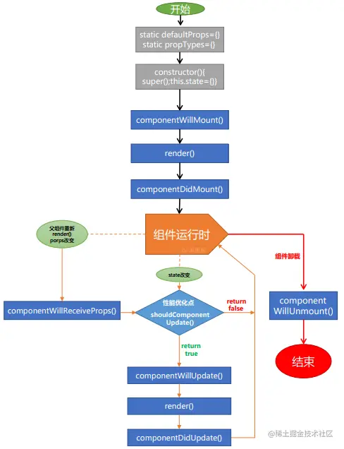
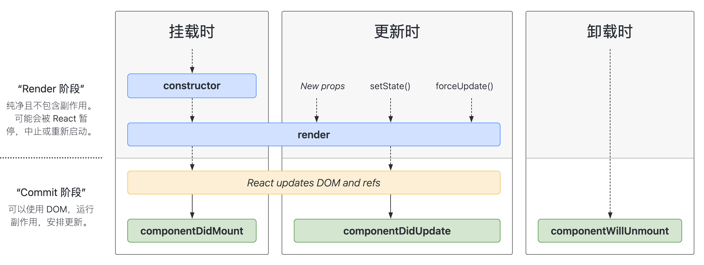
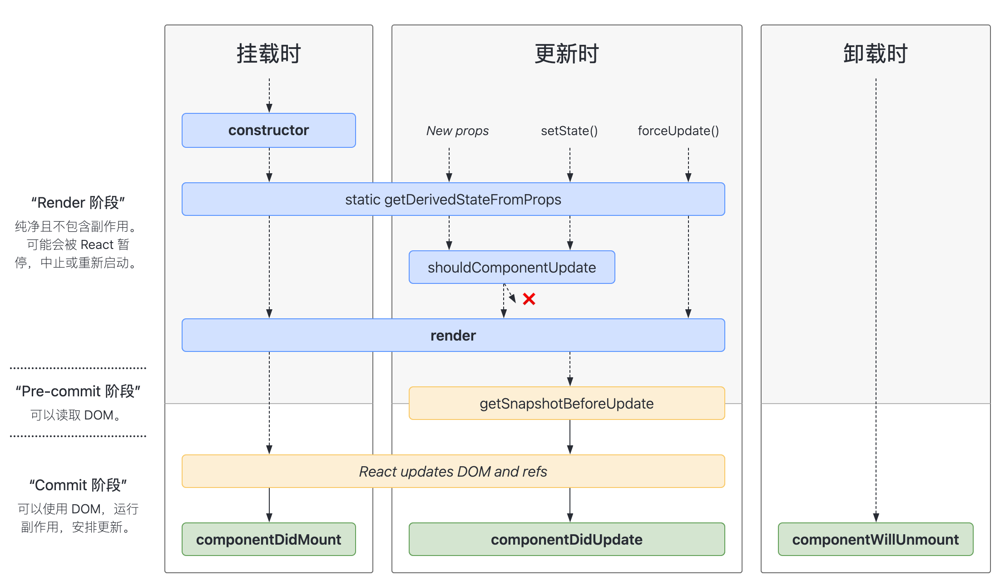

# 类组件生命周期 [​](#class)

React 生命周期指的是组件从创建到卸载的整个过程，每个过程都有对应的钩子函数会被调用，它主要有以下几个阶段：

- 挂载阶段   -  组件实例被创建和插入 DOM 树的过程
- 更新阶段   -  组件被重新渲染的过程
- 卸载阶段   -  组件从 DOM 树中被删除的过程

## 挂载阶段 [​](#mount-stage)

这个阶段是做初始化操作，主要有这几个钩子函数：

### static defaultProps

你可以定义 static defaultProps 来设置类的默认 props。它们将在 props 为 undefined 或者缺少时有效，但在 props 为 null 时无效

```js
class Button extends Component {
  static defaultProps = {
    color: 'blue'
  }

  // color值默认为blue
  render() {
    return <button className={this.props.color}>click me</button>
  }
}
```

如果 color props 未提供或者为 undefined 时，它将默认设置为 blue

```js
<>
  {/* this.props.color 为 “blue” */}
  <Button />

  {/* this.props.color 为 “blue” */}
  <Button color={undefined} />

  {/* this.props.color 为 null */}
  <Button color={null} />

  {/* this.props.color 为 “red” */}
  <Button color="red" />
</>
```

### static propTypes 

props 数据类型检查，你可以定义 static propTypes 和 prop-types 库来声明组件可接受的 props 类型。这些类型仅在渲染和开发过程中进行检查

```js
import { Component } from 'react'
import PropTypes from 'prop-types'

class Greeting extends Component {
  static propTypes = {
    name: PropTypes.string
  }

  render() {
    return <h1>Hello, {this.props.name}</h1>
  }
}
```

### constructor(props) 

constructor 会在你的类式组件 挂载（添加到屏幕上）之前运行。一般来说，在 React 中 constructor 仅用于两个目的

- 初始化 `props and state`
- 绑定事件处理函数

```js
class Counter extends Component {
  constructor(props) {
    super(props);
    this.state = { counter: 0 };
    this.handleClick = this.handleClick.bind(this);
  }

  handleClick() {
    // ...
  }
```

### componentDidMount() 

组件挂载成功钩子，该过程组件已经成功挂载到了真实 DOM 上。

由于在渲染过程中只执行一次，因此常用来：

- 监听事件；
- 获取到真实 DOM；
- 请求后台接口。

```js
componentDidMount(){
  fetch('https://api.github.com/users').then(res=>res.json()).then(users=>{
    console.log(users);
    this.setState({users});
  });
}
```

## 更新阶段 [​](#update-stage)

这个阶段主要是做状态更新操作，主要有这几个钩子函数：

### shouldComponentUpdate(nextProps, nextState)  

组件是否更新钩子

当收到新的 props 或 state 时，React 会在渲染之前调用 shouldComponentUpdate，初始渲染或使用 forceUpdate 时将不会调用此方法，由于 React 父组件更新，必然会导致子组件更新，因此我们可以在子组件中通过手动对比 `props` 与 `nextProps`，`state` 与 `nextState` 来确定是否需要重新渲染子组件，如果需要则返回`true`，不需要则返回 `false`。该函数默认返回 `true`。

```js
class Rectangle extends Component {
  state = {
    isHovered: false
  }

  shouldComponentUpdate(nextProps, nextState) {
    if (nextProps.position.x === this.props.position.x && nextProps.position.y === this.props.position.y && nextProps.size.width === this.props.size.width && nextProps.size.height === this.props.size.height && nextState.isHovered === this.state.isHovered) {
      // 没有任何改变，因此不需要重新渲染
      return false
    }
    return true
  }

  // ...
}
```

### componentDidUpdate()

此生命周期方法在组件更新完后被调用，这个方法不会在首次渲染时调用

- 因为组件已经重新渲染了所以这里可以对组件中的 DOM 进行操作
- 在比较了 `this.props`  和 `nextProps`  的前提下可以发送网络请求

参数

- prevProps：更新之前的 props。prevProps 将会与 this.props 进行比较来确定发生了什么改变
- prevState：更新之前的 state。prevState 将会与 this.state 进行比较来确定发生了什么改变
- snapshot：如果你实现了 getSnapshotBeforeUpdate 方法，那么 snapshot 将包含从该方法返回的值。否则它将是 undefined

```js
componentDidUpdate(prevProps, prevState, snapshot) {
	if (this.props.userID !== prevProps.userID) {
    this.fetchData(this.props.userID);
  }
}
```

注意

> 如果你定义了 shouldComponentUpdate 并且返回值是 false 的话，那么 componentDidUpdate 将不会被调用

## 卸载阶段 [​](#uninstall-stage)

这个阶段主要是从 DOM 树中删除组件的操作，它的钩子只有一个 `componentWillUnmount`

### componentWillUnmount() 

这是 `unmount`  阶段唯一的生命周期，在这里进行的是善后工作：清理计时器、取消网络请求或者取消事件监听等

### 老版本执行顺序图谱

   

### 17 版本生命周期

新增了两个生命周期函数：

1.  `static getDerivedStateFromProps(nextProps, prevState)`<a href='https://zh-hans.react.dev/reference/react/Component#static-getderivedstatefromprops' target='blank'>查看</a>
2.  `getSnapshotBeforeUpdate(prevProps, prevState)`<a href='https://zh-hans.react.dev/reference/react/Component#getsnapshotbeforeupdate' target='blank'>查看</a>

删除了以下生命周期函数：

1.  `componentWillMount`
2.  `componentWillReceiveProps`
3.  `componentWillUpdate`

从这个版本开始，只有新的 `UNSAFE_`  生命周期名称将起作用：

1.  `UNSAFE_componentWillMount`<a href='https://zh-hans.react.dev/reference/react/Component#unsafe_componentwillmount' target='blank'>查看</a>
2.  `UNSAFE_componentWillReceiveProps`<a href='https://zh-hans.react.dev/reference/react/Component#unsafe_componentwillreceiveprops' target='blank'>查看</a>
3.  `UNSAFE_componentWillUpdate`<a href='https://zh-hans.react.dev/reference/react/Component#unsafe_componentwillupdate' target='blank'>查看</a>

### static getDerivedStateFromProps(nextProps, prevState)

在 `render` 前调用，在初始挂载以及后续更新时都会被调用。

他应该返回一个对象来更新 `state`。如果返回 `null` 则不更新任何内容。

它接收两个参数，一个是传进来的 `nextProps` 和之前的 `prevState`。

```js
static getDerivedStateFromProps(nextProps, prevState){
  console.log('getDerivedStateFromProps',nextProps,prevState);
  return null;
}
```

### getSnapshotBeforeUpdate(prevProps, prevState)

在更新阶段 render 后挂载到真实 DOM 前进行的操作，它使得组件能在发生更改之前从 DOM 中捕获一些信息。此组件返回的任何值将作为 `componentDidUpdate` 的第三个参数。

```js
  getSnapshotBeforeUpdate(prevProps, prevState){
    return "getSnapshotBeforeUpdate";
  }

  // 组件更新成功钩子
  componentDidUpdate(prevProps, prevState, snapshot) {
    console.log(snapshot); // "getSnapshotBeforeUpdate"
  }
```

### 17 版本执行顺序图谱：

常用的生命周期：

   

包含不常用的生命周期：

   

[生命周期网站查询链接](https://projects.wojtekmaj.pl/react-lifecycle-methods-diagram/ 'https://projects.wojtekmaj.pl/react-lifecycle-methods-diagram/')
