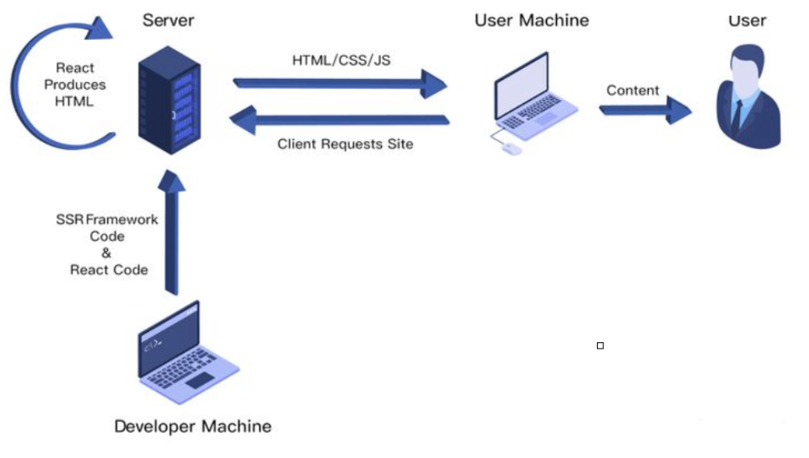

# 服务端渲染 Server-Side Rendering 

## 简介 

由服务侧完成页面的 HTML 结构拼接的页面处理技术，发送到浏览器，然后为其绑定状态与事件，成为完全可交互页面的过程

其解决的问题主要有两个：

- SEO，由于搜索引擎爬虫抓取工具可以直接查看完全渲染的页面
- 加速首屏加载，解决首屏白屏问题

## 如何做 

在 react 中，实现 SSR 主要有两种形式：

- 手动搭建一个 SSR 框架

- 使用成熟的 SSR 框架，如 Next.JS

<a href="https://vue3js.cn/interview/React/server%20side%20rendering.html#%E4%BA%8C%E3%80%81%E5%A6%82%E4%BD%95%E5%81%9A" target="blank">手动搭建</a>
