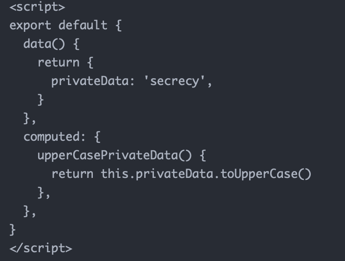
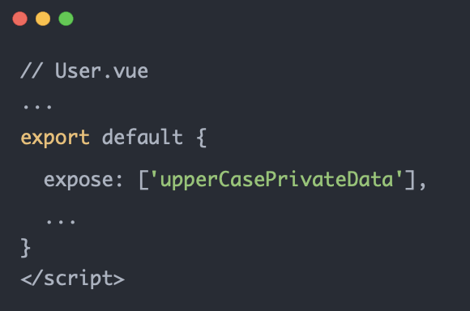
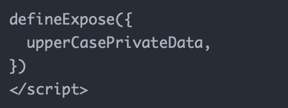

# expose [​](#expose)

暴露出组件属性，只有暴露出的可被外部访问到

在子组件中声明 privateDate 和计算属性 upperCasePrivateDate，当通过$refs 访问子组件的时候使其只能访问到 upperCasePrivateDate

   

使用 expose 暴露可被访问的属性
vue2：

   

vue3：通过 defineExpore

   
