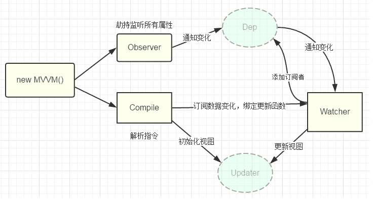

# Vue 数据双向绑定原理 

## Vue2 Object.defineProperty 

双向绑定由三个部分组成

- 数据层（Model）应用的数据及业务逻辑
- 视图层（View）应用的展示效果
- 业务逻辑层（ViewModel）负责将数据与视图关联起来

ViewModel 主要职责就是：数据变化后更新视图、视图变化后更新数据

ViewModel 由两部分组成：

- 监听器（Observer）对所有数据的属性监听
- 解析器（Compiler）对每个元素节点的指令进行扫描和解析，根据指令模板替换数据

实现原理：

- 通过数据劫持 + 发布者-订阅者模式的方式来实现的，通过 Object.defineProperty()方法来劫持（监听）各属性的 **getter、setter**，这个过程发生在 Observer 中
- 同时对模板执行编译，找到其中动态绑定的数据，从 data 中获取并初始化视图，这个过程发生在 Compile 中
- 同时定义⼀个更新函数（发布者）和 Watcher（订阅者），将来对应数据变化时 Watcher 会调用更新函数
- 由于 data 的数据在⼀个视图中可能出现多次，所以每个数据都有一个 key 来管理多个 Watcher，将来一旦发生变化会找到对应的 key 通知所有 Watcher 执行更新函数

## Vue3 proxy 

### vue3 数据双向绑定原理

1. 响应式系统：Vue3 的响应式系统是基于 ES6 的 Proxy 对象实现的。在初始化 Vue 实例时，Vue 会对数据对象进行递归地遍历，将每个属性都转换为 getter 和 setter。当属性被读取时，会触发 getter 函数，Vue 会将当前的 Watcher 对象添加到依赖列表中。当属性被修改时，会触发 setter 函数，Vue 会通知依赖列表中的每个 Watcher 对象进行更新操作，从而保证数据和视图的同步

2. 虚拟 DOM：Vue3 使用虚拟 DOM 来高效地更新视图。在初始化时，Vue 会将模板编译为虚拟 DOM 树，并将其与真实 DOM 进行比较，找出差异并更新。当数据改变时，Vue 会重新生成虚拟 DOM 树，并与之前的虚拟 DOM 树进行比较，找出差异并更新。通过虚拟 DOM 的比较和更新，可以实现对 DOM 的局部更新，从而提高渲染性能

> 总的来说，Vue3 的双向数据绑定就是通过响应式系统和虚拟 DOM 的结合来实现的。响应式系统保证了数据和视图的同步，而虚拟 DOM 则通过高效的更新方式提高了渲染性能

### vue3 响应式原理  

Vue 3 的响应式原理主要基于 ES6 的`Proxy`对象来实现。在 Vue 3 中，每个组件都有一个响应式代理对象。当组件中的数据发生变化时，这个代理对象会立即响应并更新视图。

具体来说，当一个组件被创建时，Vue 会为组件的`data`对象创建一个响应式代理对象。这个代理对象可以监听到数据的变化，并在数据变化时更新视图。代理对象通过`getter`和`setter`来实现对数据的读取和修改。当读取一个属性时，会触发相应的`getter`函数，该函数会将当前的依赖（通常是视图渲染函数或计算属性等）添加到该属性的依赖列表中。当修改一个属性时，会触发相应的`setter`函数，该函数会通知所有依赖该属性的依赖项进行更新。

Vue 3 还引入了`effect`函数来声明依赖响应式数据的函数（例如视图渲染函数）。在执行`effect`函数时，会触发响应式数据的`getter`，从而进行依赖收集。当响应式数据发生变化时，会触发`trigger`函数，根据依赖关系找到关联的`effect`函数并执行，从而实现视图的更新。

此外，Vue 3 还使用了`Reflect`对象来对代理对象的属性进行操作。`Reflect`对象提供了一些静态方法来操作对象，如`Reflect.get`、`Reflect.set`、`Reflect.deleteProperty`等。Vue 在代理对象中使用了这些方法来确保代理对象的行为与原对象尽可能一致。

总的来说，Vue 3 的响应式原理通过`Proxy`对象、`getter`、`setter`、`effect`和`Reflect`等技术手段实现了对数据的监听和视图的更新。这种机制可以有效地保证视图和数据的同步，并提供了高效的数据绑定和视图渲染机制。

## vue3 响应式原理和 vue2 的区别

**Vue 2 的响应式原理**：

Vue 2 的响应式原理主要依赖于`Object.defineProperty()`方法。此方法允许精确添加或修改对象的属性，同时可以在这些属性被读取或修改时执行一些函数。Vue 2 通过递归将`Object.defineProperty()`应用于对象的所有属性，实现了响应式数据系统。当数据发生变化时，Vue 2 会通知所有依赖该数据的部分进行更新。

**优势**：

- 基于 ES5，兼容性更好，能在更多浏览器上运行。

**劣势**：

- 当对象属性过多时，需要给每个属性都绑定`Object.defineProperty()`，效率不高。
- 不支持数组的监听，以及对象新增属性的监听。
- 对低版本浏览器支持可能存在问题。

**Vue 3 的响应式原理**：

Vue 3 的响应式原理则基于 ES6 的`Proxy`对象。`Proxy`对象可以拦截并修改某些操作的默认行为，如属性查找、赋值、枚举、函数调用等。Vue 3 使用`Proxy`为响应式数据创建一个代理对象，并在其上定义了一些拦截行为，如数据的读取、修改和删除等。

**优势**：

- 使用`Proxy`可以监听对象的所有属性变化，包括新增和删除，解决了 Vue 2 中无法监听数组和新增属性的问题。
- 不需要递归遍历对象的所有属性，提高了效率。

**劣势**：

- 由于使用了 ES6 的`Proxy`，可能在一些低版本浏览器上无法正常运行。
- 相对于 Vue 2，可能需要更多的代码来实现相同的功能，因为`Proxy`的 API 相对更复杂。
