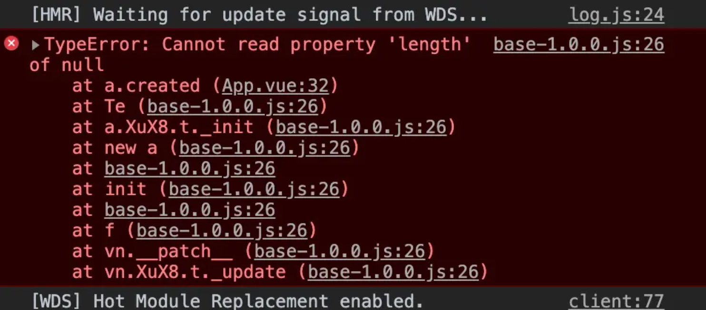
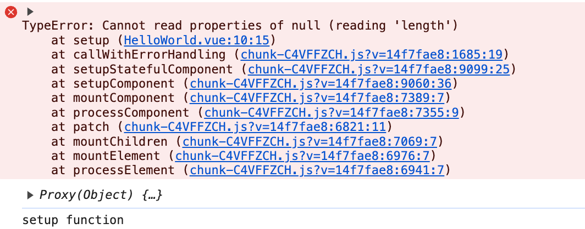

# errorHandler 错误监控 [​](#errorhandler)

在 vue 中，我们可以为错误和警告提供一个自定义的错误处理器 Vue/app.config.errorhandler

## vue 正常错误展示 [​](#normal-error)

```js
export default {
  created() {
    let a = null
    if (a.length > 1) {
      // ...
    }
  }
}
```

正常情况下，上述代码会报错：



## 使用 errorHandler [​](#errorHandler-error)

在 vue2 中：

```js
Vue.config.errorHandler = (err, insance, info) => {
  alert(err)
}
```

在 vue3 中：

```js
const app = createApp(App)

app.config.errorHandler = (err, insance, info) => {
  alert(err)
}
```

> 错误处理器接收三个参数：错误对象、触发该错误的组件实例和一个指出错误来源类型信息的字符串

在 vue3 中它可以捕获下面来源中的错误：

- 组件渲染器
- 事件处理器
- 生命周期钩子
- `setup()`函数
- 侦听器
- 自定义指令钩子
- 过渡（Transition）钩子

但 vue2 的错误处理程序几乎可以捕获所有错误

### 使用示例 [​](#template)

```vue
<!-- main.js -->
<!-- 
app.config.errorHandler = (err, instance, info) => {
  console.error(err)
  console.log(instance)
  console.log(info)
} 
-->

<!-- 组件 -->
<script setup>
import { ref } from 'vue'

const num = ref(null)

// 报错
if (num.value.length > 1) {
}
</script>
```

控制台报错：


