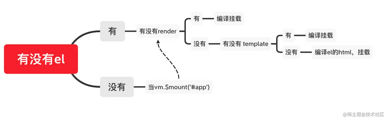

# el、template、render、mount 的用法 

优先级：render > template > el 或 $mount，没有 render 的时候，template 或 el 最终都会变成 render 函数

el 等价于$mount，只有 template 是不行的，vue 对象不知道把 template 放在何处，只有 render 也不行

## el

用法：`new Vue({el:'#app'})`

- 提供一个在页面上**已存在的** DOM 元素作为 Vue 实例的**挂载**元素，其会被 Vue 生成的 DOM **替换**

- 在实例**挂载之后**，元素可以用 `vm.$el` 访问

- 如果在实例化时存在这个选项，实例将**立即进入**编译过程，否则，需要显式调用 `vm.$mount()`，手动开启编译

- 如果 `render` 函数和 `template` 属性都不存在，挂载 DOM 元素的 HTML 会被提取出来用作模板

## template

用法：`new Vue({template:"
{{msg}}
"})`

- 一个字符串模板，模板将会替换挂载的元素，挂载元素的内容都将被忽略，除非模板的内容有分发插槽

- 如果值以 # 开始，则它将被用作选择符，并使用匹配元素的 innerHTML 作为模板常用的技巧是用 `<script type="x-template">`包含模板

- 如果 `render` 函数存在，该模板将被忽略

## render

用法：`new Vue({render(createElement){return createElement('div','hello') }})`

- createElement 简写为 h

- 字符串模板的代替方案，允许你发挥 JavaScript 最大的编程能力该渲染函数接收一个 createElement 方法作为第一个参数用来创建 VNode

- 如果组件是一个函数组件，渲染函数还会接收一个额外的 context 参数，为没有实例的函数组件提供上下文信息

- render 函数若存在，将直接作为模板编译，而完全无视 template 或 el 挂载元素中提取出的 HTML 模板

## mount

用法：`new Vue({...}).$mount('#app')`

- `var vm = new Vue({...}).$mount(); document.body.appendChild(vm.$el)`

- 如果实例化时没有收到 el 选项，则它处于“未挂载”状态，没有关联的 DOM 元素可以使用 `vm.$mount()` 手动地挂载一个未挂载的实例

- 如果没有提供参数，模板将被渲染为文档之外的的元素，并且你必须使用**原生 DOM API**把它插入文档中

- $mount()为手动挂载，在项目中可用于延时挂载（例如在挂载之前要进行一些其他操作、判断等）,跟 el 没有本质区别
