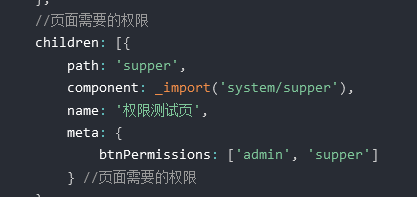

# 权限管理 [](#permission)

## 接口权限

接口权限目前一般采用 jwt 的形式来验证，没有通过的话一般返回 401，跳转到登录页面重新进行登录，登录完拿到 token，将 token 存起来，通过 axios 请求拦截器进行拦截，每次请求的时候头部携带 token

## 路由权限控制

登陆后，获取用户的权限信息，然后筛选有权限访问的路由，在全局路由守卫里面进行调用 addRoutes 添加路由

## 菜单权限

每次路由跳转的时候都要判断权限，要使菜单的 name 与路由的 name 是一一对应的，后端返回的菜单就已经是经过权限过滤的，如果根据路由 name 找不到对应的菜单，就表示用户有没权限访问，如果路由很多，可以在应用初始化的时候，只挂载不需要权限控制的路由，取得后端返回的菜单后，根据菜单与路由的对应关系，筛选出可访问的路由，通过 addRoutes 动态挂载

另一种时菜单和路由都由后端返回，通过 addRoutes 挂载之前需要将数据处理一下，如果有嵌套路由，前端也需要处理

```js
;[
  {
    name: 'home',
    path: '/',
    component: 'home'
  },
  {
    name: 'home',
    path: '/userinfo',
    component: 'userInfo'
  }
]
```

## 按钮权限

- v-if
- 自定义指令

在路由的 meta 中配置，然后按钮上进行筛选


