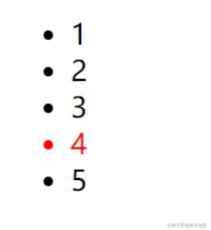

# v-memo 缓存一个模板的子树 [​](#v-memo)

它接受一个数组，数组中存放依赖的值，数组中的依赖值都没有发生变化时，使用 v-memo 的组件/元素将跳过组件更新（包括其子树）。

## v-memo 基础使用 [​](#v-mome-basic)

```vue
<script setup>
import { ref } from 'vue'

const name = ref('loftyamb')
const age = ref(24)

const handleBtnClick = () => {
  age.value++ // age值的变化将不会更新到页面中，除非name发生变化
}
</script>

<template>
  <div v-memo="[name]">
    <div>{{ name }}</div>
    <div>{{ age }}</div>
    <div>{{ message }}</div>
  </div>
  <button @click="handleBtnClick">change</button>
</template>
```

## v-memo 配合 v-for 使用 [​](#v-mome-vFor)

v-memo 能够在一些场景下对性能进行细小的优化（不该被滥用），例如：

假设我们有一个长列表需要渲染，并且列表项会因为用户的操作发生变化：

```vue
<script setup>
import { ref } from 'vue'

const handleRefChange = () => {
  console.log('change')
}
const active = ref(1)
const handleItemClick = (item) => {
  active.value = item
}
</script>

<template>
  <div class="memo-demo">
    <ul>
      <li v-for="item in 5" :key="item" :class="{ active: item === active }" @click="handleItemClick(item)" :ref="handleRefChange">
        {{ item }}
      </li>
    </ul>
  </div>
</template>

<style scoped>
.active {
  color: red;
}
</style>
```

上面代码中的`handleRefChange`会在每次绑定 ref 的元素更新时（包括初始化）被调用，我们可以在浏览器控制台中看到 li 元素初始化的时候被调用 5 次（因为遍历生成了 5 个 li 元素）：

   

   

而如果我们点击其中一个非 active 的 li 元素时，我们会发现`handleRefChange`又再次被调用了 5 次，也就是 5 个 li 元素都发生了更新（因为它们所依赖的`active`值变化了）：

   

但实际上，我们并不需要对每个 li 元素都进行更新，只需要对所依赖`item === active`的值发生更新的时候才进行更新即可。在这种情况下，我们可以使用`v-memo`指令来实现优化：

```vue
<template>
  <li v-for="item in 5" :key="item" :class="{ active: item === active }" @click="handleItemClick(item)" v-memo="[item === active]" :ref="handleRefChange">
    {{ item }}
  </li>
</template>
```

当使用了`v-meomo`指令之后，我们就会发现每次点击非 active 的 li 元素的之后，`handleRefChange`只被调用 2 次，因为只有点击之前「active 的 li 元素」和「被点击的 li 元素」所依赖的`item === active`值会发现变化：

   

通过`v-memo`指令，我们可以在更新内容很多时减少一些不必要的更新，从而对性能进行优化。
